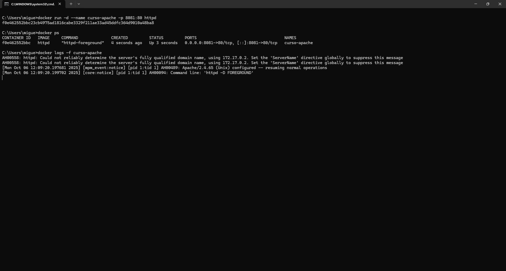
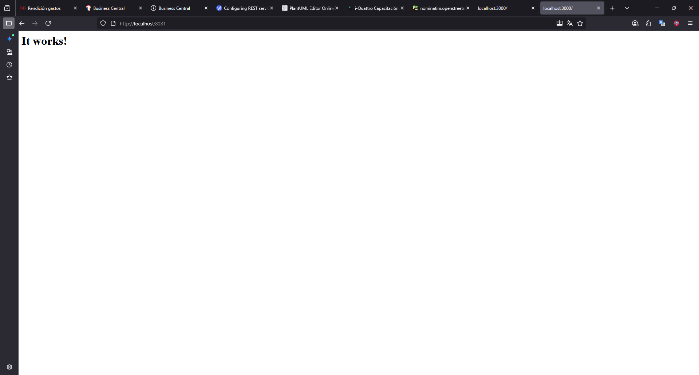
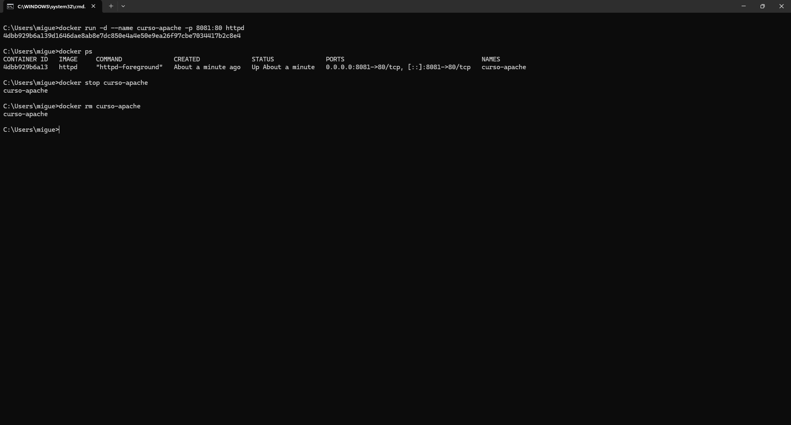

# Clase 1 - Introducción a Containers y Docker

## 🎯 Objetivo

Desplegar un servidor web httpd usando Docker.

## Desarrollo


### 1.- Descargar imagenes
**Descripción:**
Descarga la última versión de la imagen oficial de Apache HTTP Server (httpd) desde Docker Hub.
Esta imagen contiene el servidor web listo para ser ejecutado en un contenedor.

```bash
docker pull httpd:latest
```


### 2.- Iniciar Contenedor
**Descripción:**
El comando docker run crea y ejecuta un contenedor basado en la imagen httpd, mapeando el puerto 8081 del equipo local al 80 del contenedor (donde Apache sirve las páginas web).
Luego, docker ps muestra los contenedores activos, y docker logs -f curso-apache permite ver los registros en tiempo real.

```bash
docker run -d --name curso-apache -p 8081:80 httpd
docker ps
docker logs -f curso-apache
```




### 2.- Acceder desde el navegador
**Descripción:**
Al ingresar desde el navegador se visualiza la página por defecto de Apache con el texto "It works!", lo que confirma que el contenedor está ejecutando el servidor web correctamente y que el mapeo de puertos funciona.
Accedí a `http://localhost:8081` y obtuve:



### 3.-Limpiar Contenedor
**Descripción:**
docker stop detiene el contenedor en ejecución y docker rm lo elimina del sistema.
Estos comandos permiten mantener el entorno limpio y liberar recursos una vez terminada la práctica.
```bash
docker run -d --name curso-apache -p 8081:80 httpd
docker ps
docker stop curso-apache
docker rm curso-apache
```




## Conclusiones
- Se comprendió cómo descargar imágenes y ejecutar contenedores con Docker.
- Se aprendió a mapear puertos para acceder desde el navegador.
- Se verificó el estado y los logs del contenedor.
- Se completó el ciclo de vida básico de un contenedor: crear → ejecutar → verificar → eliminar.