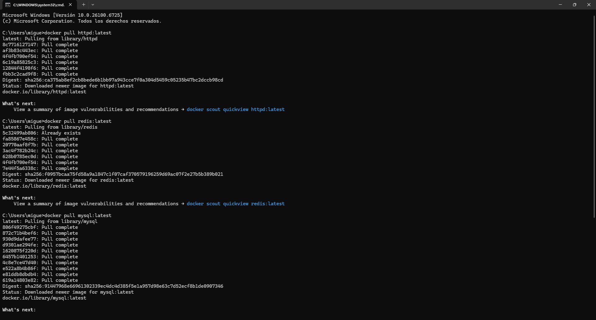

# Clase 1 - Introducción a Containers y Docker

## Objetivo

Desplegar un servidor web httpd usando Docker.

## Desarrollo


### 1.- Descargar imagenes

```bash
docker pull httpd:latest
```



### 2.- Iniciar Contenedor
```bash
docker run -d --name curso-apache -p 8081:80 httpd
docker ps
docker logs -f curso-apache
```


### 2.- Acceder desde el navegador
Accedí a `http://localhost:8081` y obtuve:


### 3.-Limpiar Contenedor
```bash
docker run -d --name curso-apache -p 8081:80 httpd
docker ps
docker stop curso-apache
docker rm curso-apache
```


**Explicación:** Este comando crea y ejecuta un container con nginx en segundo plano (-d), mapeando el puerto 8080 de mi máquina al puerto 80 del container.


## Conclusiones

Aprendí a ejecutar containers en segundo plano y mapear puertos. 