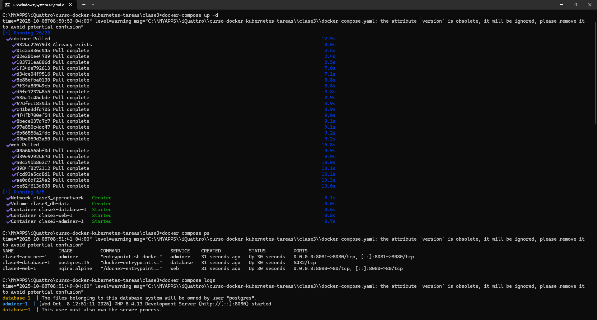

# 📦 Aplicación Multi-Contenedor con Docker Compose

**Curso:** Docker & Kubernetes - Clase 3  
**Estudiante:** Miguel Claure Villca 
**Descripción:** Aplicación demostrativa con Nginx, PostgreSQL y Adminer orquestada con Docker Compose, implementando redes custom y volúmenes persistentes.

## 🛠 Stack Tecnológico

| Componente | Tecnología |
|------------|------------|
| **Servidor Web** | Nginx (Alpine) |
| **Base de Datos** | PostgreSQL 15 |
| **Interfaz Web DB** | Adminer |
| **Orquestación** | Docker Compose |
| **Red** | Docker Network (bridge) |
| **Persistencia** | Docker Volume |

## 🚀 Ejecución

### Prerrequisitos
- Docker instalado
- Docker Compose instalado
- Puertos 8080 y 8081 disponibles

### Pasos para ejecutar

1. **Clonar y acceder al directorio:**
   ```bash
   git clone https://github.com/sureflatron/curso-docker-kubernetes-tareas.git
   cd curso-docker-kubernetes-tareas/clase3

   ```


2. **Levantar Contenedores**
```bash
#Descargar imagenes a usar
docker-compose pull

#Iniciar Contenedores
docker-compose up -d

#Listar contenedores levantados
docker-compose ps

#Revisar Log
docker-compose logs
```
   


3. **Validar Comnunicacion entre contenedores**
```bash
# Probar conectividad desde web a database
docker compose exec web ping database

# Probar conexión a PostgreSQL
docker compose exec database psql -U admin -d myapp -c "SELECT version();"
```