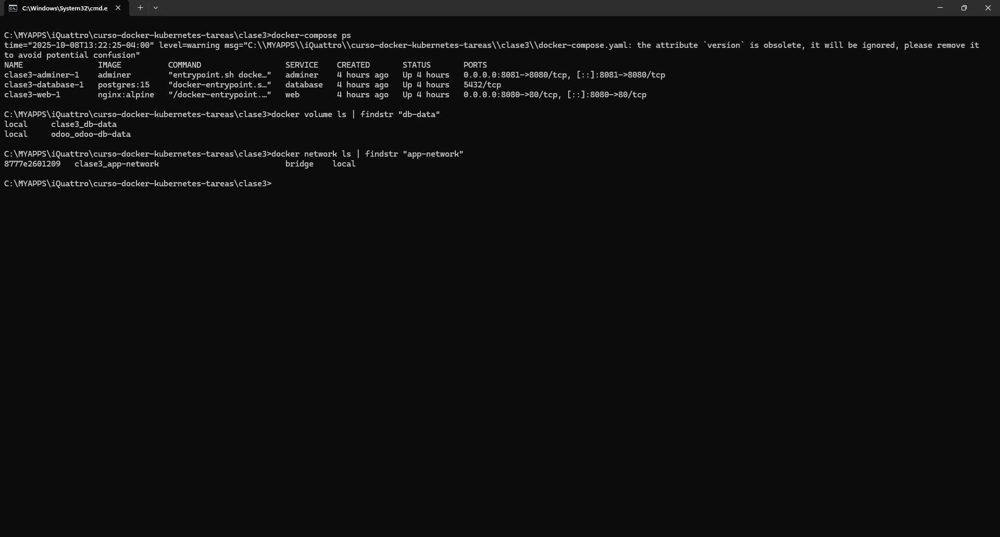
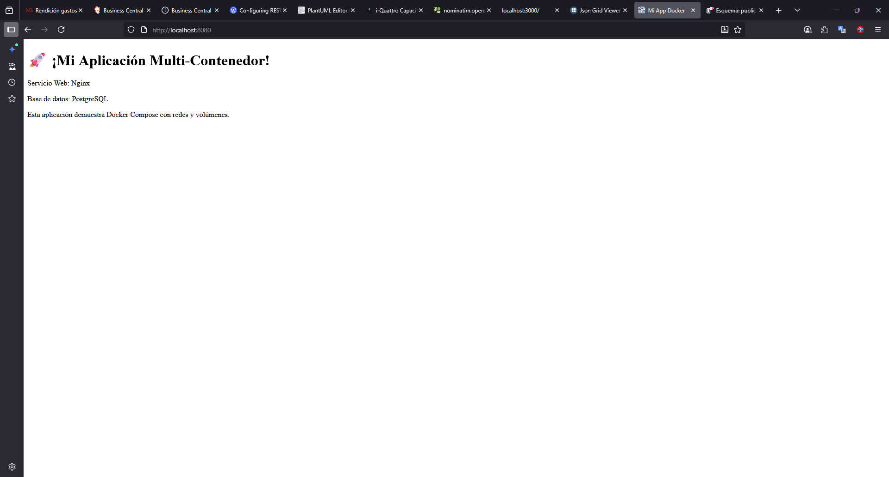
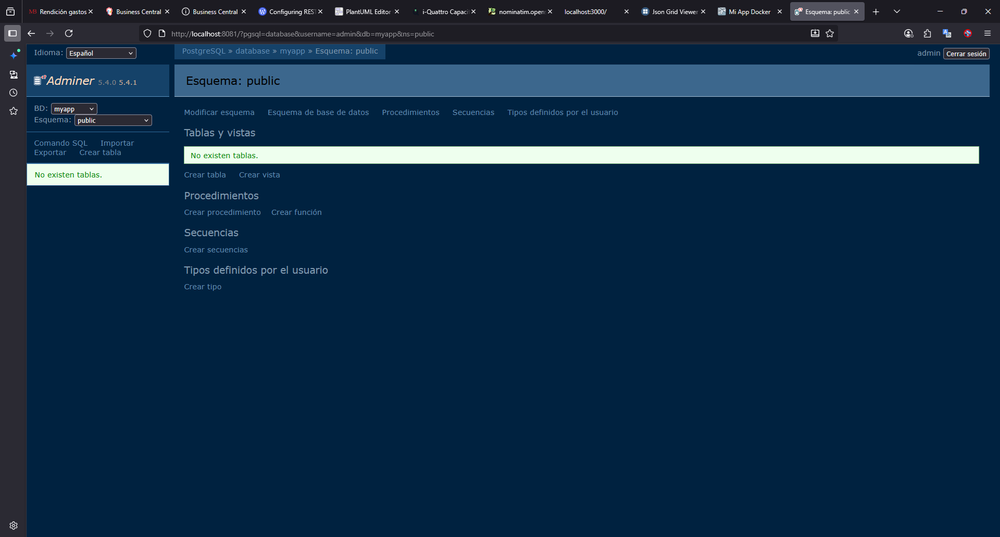
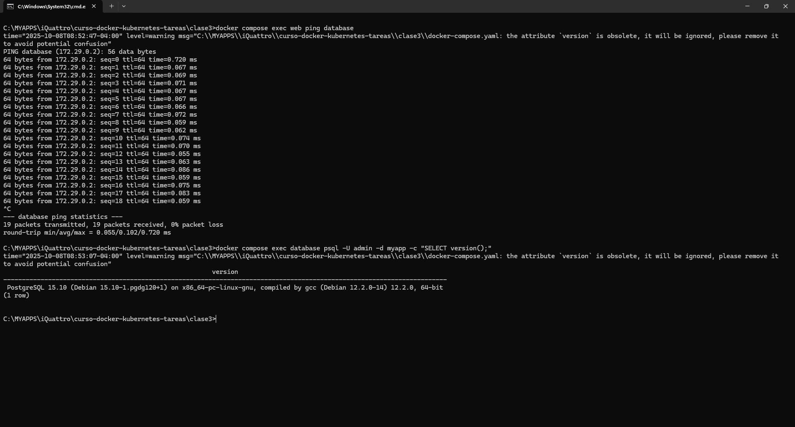
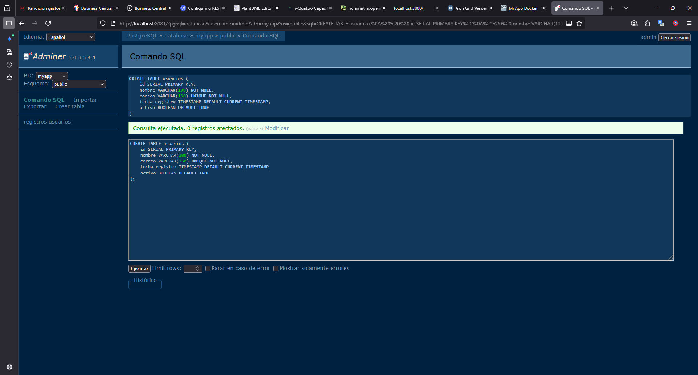
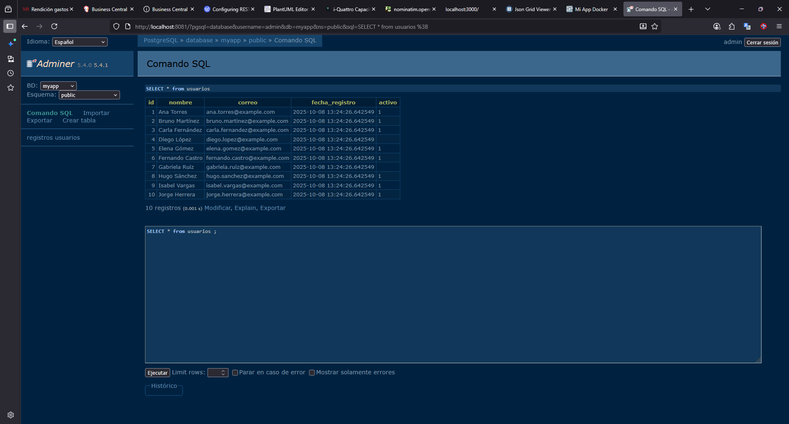
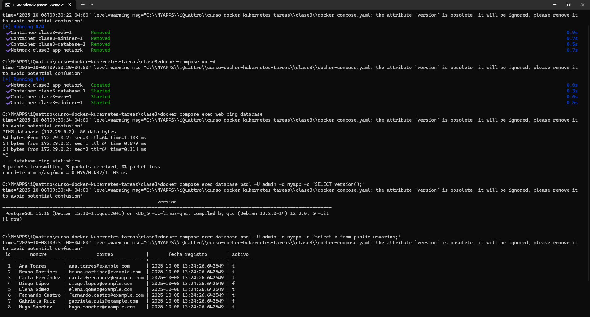
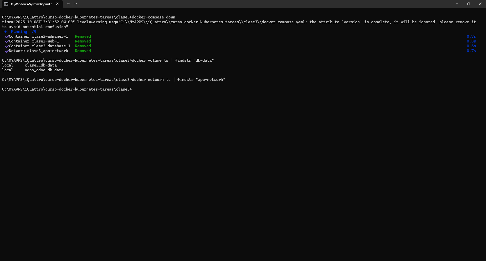

# 📦 Aplicación Multi-Contenedor con Docker Compose

**Curso:** Docker & Kubernetes - Clase 3  
**Estudiante:** Miguel Claure Villca
**Descripción:** Aplicación demostrativa con Nginx, PostgreSQL y Adminer orquestada con Docker Compose, implementando redes custom y volúmenes persistentes.

## 🛠 Stack Tecnológico

| Componente | Tecnología |
|------------|------------|
| **Servidor Web** | Nginx (Alpine) |
| **Base de Datos** | PostgreSQL 15 |
| **Interfaz Web DB** | Adminer |
| **Orquestación** | Docker Compose |
| **Red** | Docker Network (bridge) |
| **Persistencia** | Docker Volume |

## 🚀 Ejecución

### Prerrequisitos
- Docker instalado
- Docker Compose instalado
- Puertos 8080 y 8081 disponibles

### Pasos para ejecutar

1. **Clonar y acceder al directorio:**
   ```bash
   #Clonar Repositorio
   git clone https://github.com/sureflatron/curso-docker-kubernetes-tareas.git
   #Ingreasar a la tarea
   cd curso-docker-kubernetes-tareas/clase3
   ```


2. **Levantar Contenedores**
```bash
#Descargar imagenes a usar
docker-compose pull

#Iniciar Contenedores
docker-compose up -d

#Listar contenedores levantados
docker-compose ps

#Revisar Log
docker-compose logs
```


3. **Validar por Comandos**
```bash
#Listar contenedores levantados
docker-compose ps 

#Buscar volumen creado, para linux usar grep windows  findstr        
docker volume ls | findstr "db-data"

#Buscar red creada, para linux usar grep windows  findstr 
docker docker network ls | findstr "app-network" 
```


4. **Validar por Interfaz Web**

Ingresar a Ngnix: http:/localhost:8080


Ingresar a Adminer: http:/localhost:8081


5. **Validar Comnunicacion entre contenedores**
```bash
# Probar conectividad desde web a database
docker compose exec web ping database

# Probar conexión a PostgreSQL
docker compose exec database psql -U admin -d myapp -c "SELECT version();"
```


6. **Persistir Informacion**
  Crear Tabla Usuario y Cargar Datos
```sql
-- Adminer 5.4.0 PostgreSQL 15.10 dump

CREATE DATABASE "myapp";
\connect "myapp";

DROP TABLE IF EXISTS "usuarios";
DROP SEQUENCE IF EXISTS usuarios_id_seq;
CREATE SEQUENCE usuarios_id_seq INCREMENT 1 MINVALUE 1 MAXVALUE 2147483647 CACHE 1;

CREATE TABLE "public"."usuarios" (
    "id" integer DEFAULT nextval('usuarios_id_seq') NOT NULL,
    "nombre" character varying(100) NOT NULL,
    "correo" character varying(150) NOT NULL,
    "fecha_registro" timestamp DEFAULT CURRENT_TIMESTAMP,
    "activo" boolean DEFAULT true,
    CONSTRAINT "usuarios_pkey" PRIMARY KEY ("id")
)
WITH (oids = false);

CREATE UNIQUE INDEX usuarios_correo_key ON public.usuarios USING btree (correo);

INSERT INTO "usuarios" ("id", "nombre", "correo", "fecha_registro", "activo") VALUES
(1,	'Ana Torres',	'ana.torres@example.com',	'2025-10-08 13:24:26.642549',	'1'),
(2,	'Bruno Martínez',	'bruno.martinez@example.com',	'2025-10-08 13:24:26.642549',	'1'),
(3,	'Carla Fernández',	'carla.fernandez@example.com',	'2025-10-08 13:24:26.642549',	'1'),
(4,	'Diego López',	'diego.lopez@example.com',	'2025-10-08 13:24:26.642549',	'0'),
(5,	'Elena Gómez',	'elena.gomez@example.com',	'2025-10-08 13:24:26.642549',	'1'),
(6,	'Fernando Castro',	'fernando.castro@example.com',	'2025-10-08 13:24:26.642549',	'1'),
(7,	'Gabriela Ruiz',	'gabriela.ruiz@example.com',	'2025-10-08 13:24:26.642549',	'0'),
(8,	'Hugo Sánchez',	'hugo.sanchez@example.com',	'2025-10-08 13:24:26.642549',	'1'),
(9,	'Isabel Vargas',	'isabel.vargas@example.com',	'2025-10-08 13:24:26.642549',	'1'),
(10,	'Jorge Herrera',	'jorge.herrera@example.com',	'2025-10-08 13:24:26.642549',	'1');

-- 2025-10-08 16:47:26 UTC
```



7. **Reiniciar Contenedores**
```bash
#Detener Contenedores sin eliminacion de volumenes
docker-compose down

#Iniciar COntennedores
docker-compose up -d

# Probar conectividad desde web a database
docker compose exec web ping database

# Probar conexión a PostgreSQL
docker compose exec database psql -U admin -d myapp -c "SELECT version();"

#Consultar la tabla usuarios
docker compose exec database psql -U admin -d myapp -c "select * from public.usuarios;"

```
   


8. **Validar la Persistencia**
Ingresar a Adminer y validar la tabla URL:http://localhost:8081/?pgsql=database&username=admin&db=myapp&ns=public&select=usuarios


9. **Validacion  Persistencia del Volumen**
```bash
#LDetener contenedores
docker-compose down

#Buscar volumen creado, para linux usar grep windows  findstr        
docker volume ls | findstr "db-data"

#Buscar red creada, para linux usar grep windows  findstr 
docker docker network ls | findstr "app-network" 
```



10. **Conceptos Aplicados**

🏗️ Docker Compose
3 servicios orquestados: web, database, adminer

Dependencias configuradas con depends_on

Variables de entorno para configuración de PostgreSQL

Mapeo de puertos para acceso externo

🌐 Redes
Red custom: app-network (driver bridge)

Comunicación interna: servicios se conectan por nombre

Aislamiento: red dedicada para la aplicación

💾 Volúmenes
Named volume: db-data para persistencia de PostgreSQL

Persistencia: datos sobreviven a docker compose down

Bind mount: contenido web mapeado desde host
```yaml
# Variables de entorno
POSTGRES_DB: myapp
POSTGRES_USER: admin  
POSTGRES_PASSWORD: password123

# Mapeo de puertos
web: 8080:80
adminer: 8081:8080
```