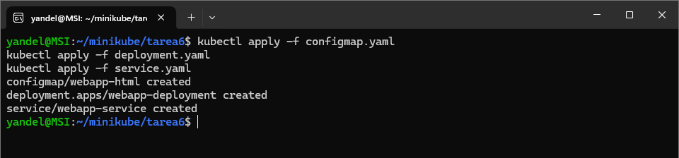
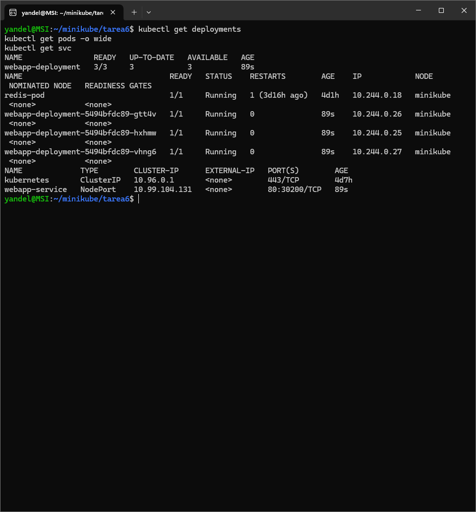
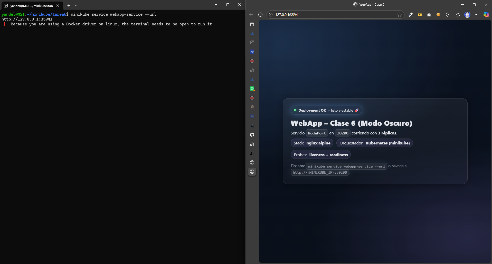
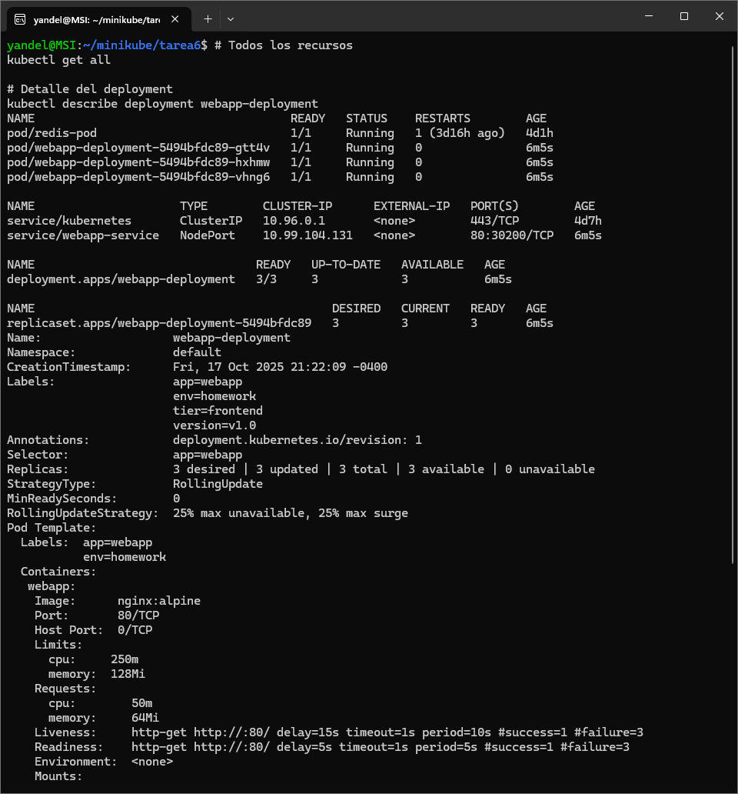
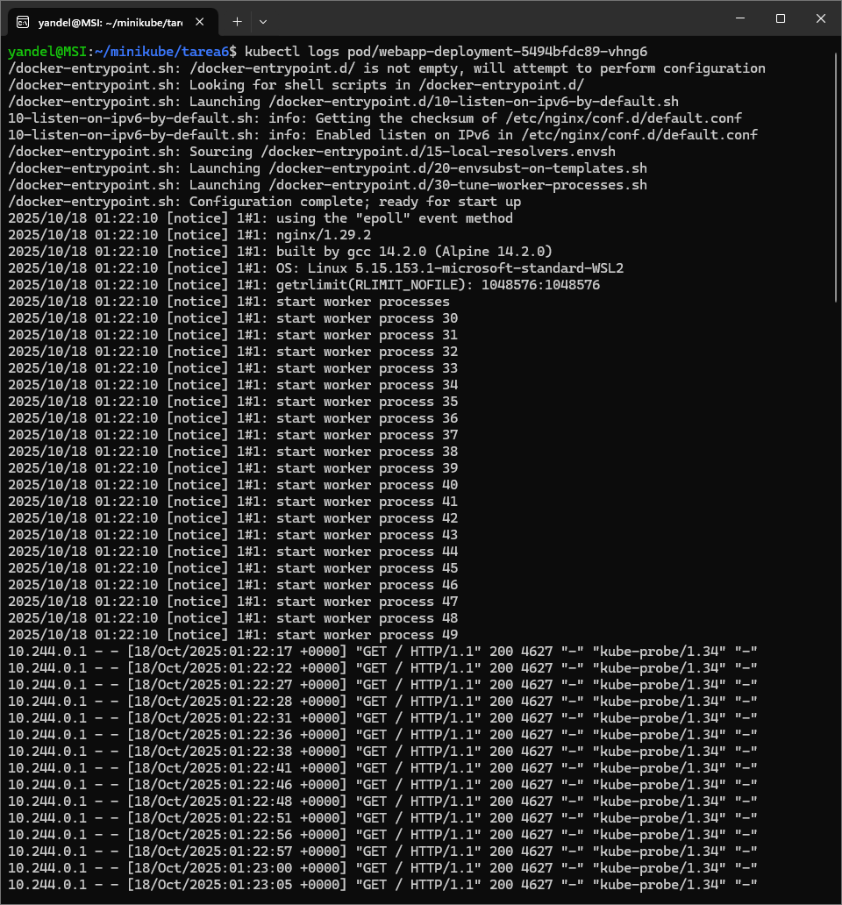
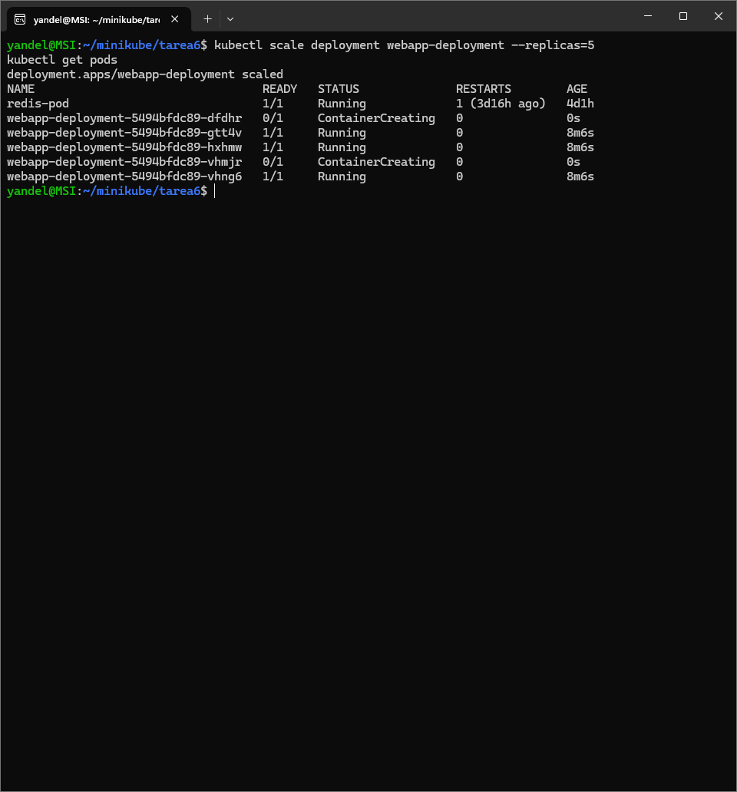
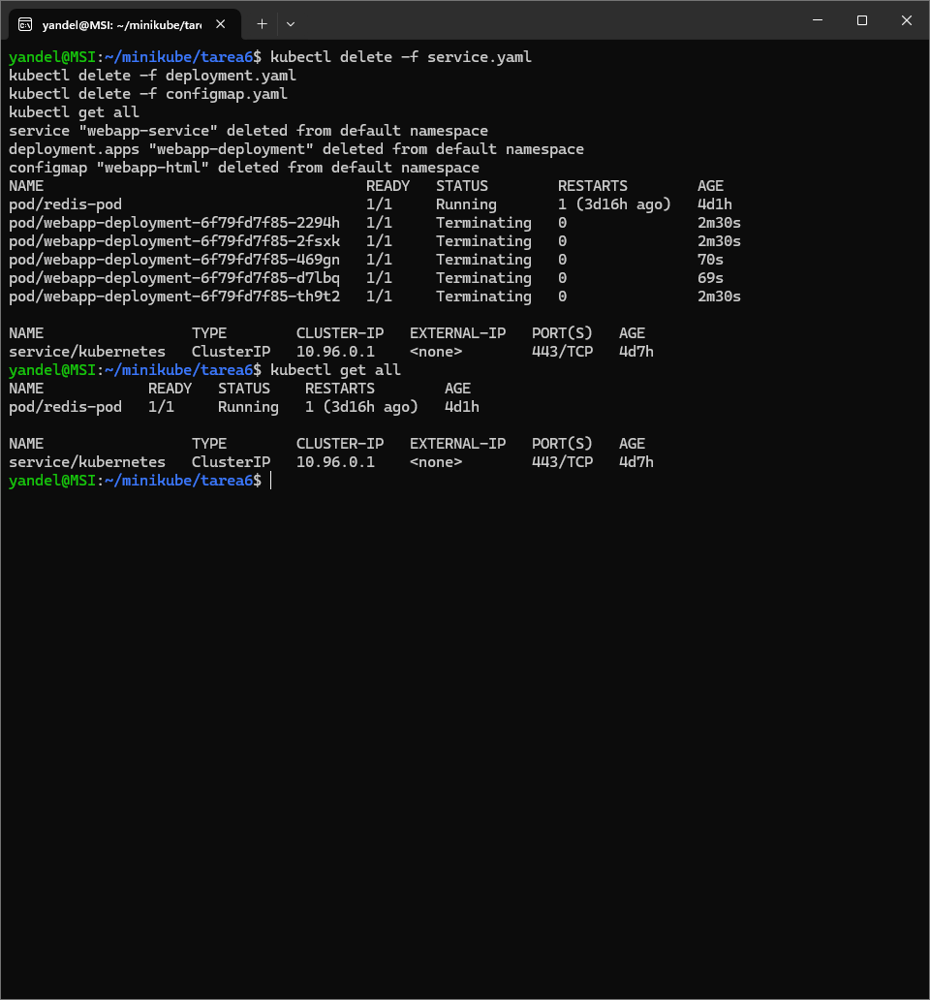
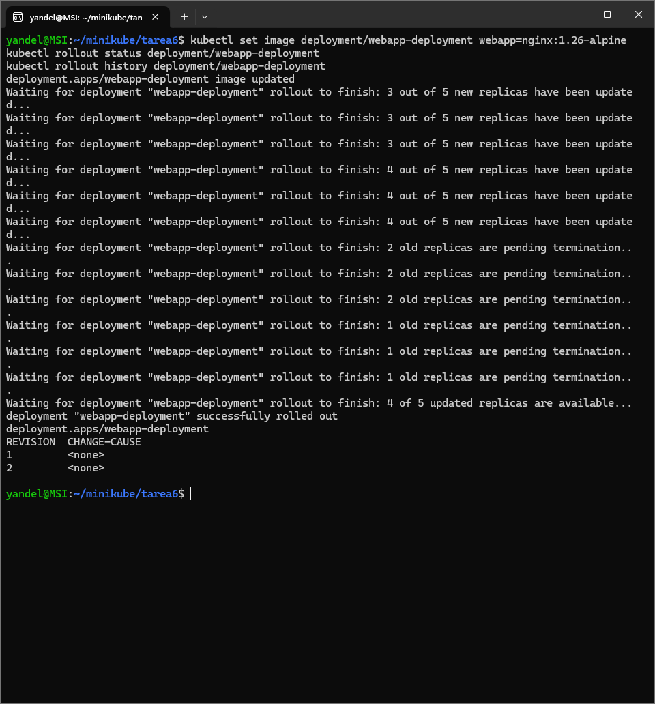

# WebApp – Clase 6 (Deployment & Service)

**Curso:** Docker & Kubernetes – Clase 6  
**Estudiante:** Miguel Claure

Despliegue de una aplicación web en Kubernetes usando **Deployment** (3 réplicas) y **Service** tipo **NodePort** (30200) sobre **minikube**.

---

## Stack
- **Aplicación:** Nginx (nginx:alpine)  
- **Orquestador:** Kubernetes (minikube)  
- **Réplicas:** 3

---

## Descarga
```bash
# Clonar repositorio
git clone https://github.com/sureflatron/curso-docker-kubernetes-tareas.git

#Ingreasar a la tarea
cd curso-docker-kubernetes-tareas/clase6

```

## Ejecución

1) Aplicar manifests
```bash
kubectl apply -f configmap.yaml
kubectl apply -f deployment.yaml
kubectl apply -f service.yaml

``` 
 

2) Verificar
```bash
kubectl get deployments
kubectl get pods -o wide
kubectl get svc
```
 

3) Acceder a la app
- Con minikube:
```bash
minikube service webapp-service --url
# o abre en navegador directamente {#o-abre-en-navegador-directamente  data-source-line="172"}
minikube service webapp-service
```
 

---

## Pruebas / Verificación

```bash
# Todos los recursos
kubectl get all

# Detalle del deployment
kubectl describe deployment webapp-deployment

# Logs de un pod
kubectl logs <nombre-del-pod>

# Escalar a 5 réplicas 
kubectl scale deployment webapp-deployment --replicas=5
kubectl get pods

# Auto-healing: elimina un pod y observa reposición 
kubectl delete pod <nombre-del-pod>
kubectl get pods -w
```
 
 
 
---


---


## Conceptos aplicados
- Deployment con 3 réplicas  
- Service tipo NodePort  
- Labels & selectors  
- Auto-healing  
- Escalado horizontal

---

## Limpieza
```bash
kubectl delete -f service.yaml
kubectl delete -f deployment.yaml
kubectl delete -f configmap.yaml
kubectl get all
```
 
---


### Rolling update a `nginx:1.26-alpine`
```bash
kubectl set image deployment/webapp-deployment webapp=nginx:1.26-alpine
kubectl rollout status deployment/webapp-deployment
kubectl rollout history deployment/webapp-deployment
``` 
 


---

