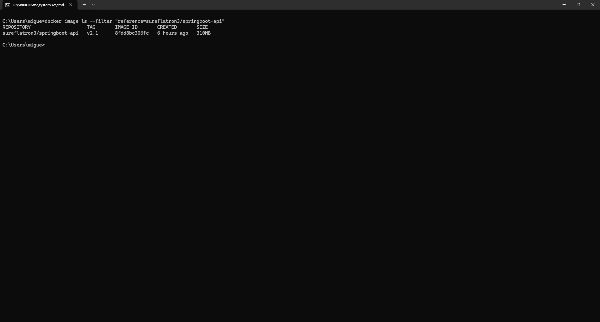
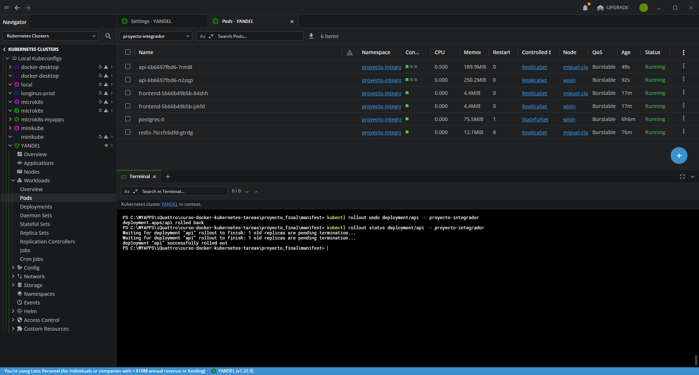
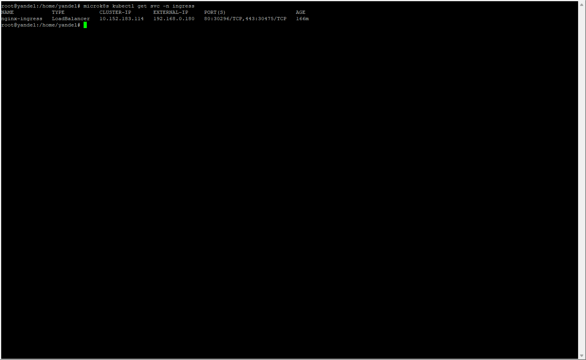

# Proyecto Final - Docker & Kubernetes

   **Alumno:** Miguel Claure Villca
   
   **Fecha:** 26/10/2025
   
   **Curso:** Docker & Kubernetes - i-Quattro

   ## Links de Docker Hub
   - Backend v2.1: https://hub.docker.com/repository/docker/sureflatron3/springboot-api/general
   - Frontend v2.2: https://hub.docker.com/repository/docker/sureflatron3/angular-frontend/general

## Descarga
```bash
# Clonar repositorio
git clone https://github.com/sureflatron/curso-docker-kubernetes-tareas.git

#Ingreasar a la tarea
cd curso-docker-kubernetes-tareas/proyecto_final

```

   ## Parte 1: Setup del Ambiente

   **Ambiente utilizado:**
   - VirtualBox
   - Nombre de VM/Instancia: wisin y yandel
   - Sistema operativo: Ubuntu 24.04 LTS
   - Recursos: 8GB RAM, 4 CPU cores
   - Red configurada: Bridged
   - Rango MetalLB: 192.168.0.180 - 192.168.0.190
   
   
   **Master:** yandel
   
   
   **Worker:** wisin
    

   **LENS:**
   
   

   ### ./screenshots
   
   
   
   
   
   

   ## Parte 2: Backend v2.1


   Se modifico el controlador Metodo /api/info, para mostrar
   | Campo       | Descripción                                                                                  |
| ----------- | -------------------------------------------------------------------------------------------- |
| `alumno`    | Nombre del desarrollador o participante del curso.                                           |
| `version`   | Versión actual de la API o microservicio.                                                    |
| `curso`     | Nombre del curso o contexto del proyecto.                                                    |
| `timestamp` | Fecha y hora actual del servidor en formato ISO-8601.                                        |
| `hostname`  | Nombre del host o contenedor donde corre la aplicación (útil en entornos Docker/Kubernetes). |


   ### Código Agregado

   ```java
       @GetMapping("/api/info")
    public ResponseEntity<Map<String, Object>> getInfo() {
        Map<String, Object> info = new HashMap<>();
        info.put("alumno", "Miguel Claure Villca");
        info.put("version", "v2.1");
        info.put("curso", "Docker & Kubernetes - i-Quattro");
        info.put("timestamp", LocalDateTime.now().toString());
        info.put("hostname", System.getenv("HOSTNAME"));
        return ResponseEntity.ok(info);
    }
   ```

   ### ./screenshots

   
   
   https://hub.docker.com/r/sureflatron3/springboot-api
   
   <!--  revisar-->
    
   
   

   
   
   

   ## Parte 3: Frontend v2.2
   Se adciono el consumo al metodo /api/info:
   ``` js

       // ... propiedades existentes ...
       systemInfo: any = null;
       // ... métodos existentes ...
       getSystemInfo(): void {
          this.http.get('/api/info').subscribe({
            next: (data) => {
              this.systemInfo = data;
              this.success = 'Información del sistema cargada';
              setTimeout(() => this.success = null, 3000);
            },
            error: (err) => {
              this.error = 'Error al obtener información del sistema';
              console.error('Error:', err);
            }
          });
        }
   ```
   Se adiciono un boton para mostrar los detalles del metodo /api/info:
   ``` js
     <div class="form-group">
      <button (click)="getSystemInfo()" class="btn-primary">
       Ver Info del Sistema
      </button>
     </div>

   <div *ngIf="systemInfo" class="card info-section">
      <h3>Información del Sistema</h3>
      <p><strong>Alumno:</strong> {{ systemInfo.alumno }}</p>
      <p><strong>Versión:</strong> {{ systemInfo.version }}</p>
      <p><strong>Curso:</strong> {{ systemInfo.curso }}</p>
      <p><strong>Timestamp:</strong> {{ systemInfo.timestamp }}</p>
      <p><strong>Pod:</strong> {{ systemInfo.hostname }}</p>
   </div>
   ```

   ### ./screenshots Front-End
   

   
   
   https://hub.docker.com/r/sureflatron3/angular-frontend
   
   <!-- revisar -->
   
   
   


  
  
   ### ./screenshots Kong (solo para local con docker)

   
   
   ## Parte 4: Gestión de Versiones

   ### ¿Qué hace kubectl rollout undo?
  El comando kubectl rollout undo me permite revertir el Deployment en Kubernetes a una versión anterior registrada.
Cada vez que aplico un cambio en la aplicación (por ejemplo, cambias la imagen Docker), Kubernetes crea una nueva revisión (revision) del deployment.
Si esa versión presenta errores, este comando permite volver de forma segura a la versión anterior sin necesidad de eliminar recursos o interrumpir el servicio.

   ### ./screenshots
   Backend
   
   
   
   
   

   Frontend
   
   
   
   ## Parte 5: Ingress + MetalLB

   **IP del Ingress:** (http://192.168.0.180/)

   ### ./screenshots

   
   
   
   
   
    

   
 
   

   ## Conclusiones

   ### Aprendizajes principales
  Aprendí a construir, versionar y publicar imágenes Docker en Docker Hub de forma estructurada, siguiendo buenas prácticas de etiquetado y documentación.

Comprendí el flujo completo de despliegue en Kubernetes, desde la creación de Pods, Services e Ingress hasta la exposición externa mediante MetalLB.

Dominar los comandos kubectl apply, kubectl rollout y kubectl get me permitió gestionar versiones, monitorear actualizaciones y garantizar despliegues sin interrupciones.

   ### Dificultades encontradas
 Configuración de Ingress y MetalLB: inicialmente no se asignaba una IP externa, lo que impedía acceder al frontend.
**Solución:** creé manualmente el Service nginx-ingress tipo LoadBalancer para vincularlo con MetalLB y obtener la IP 192.168.x.x.

Comunicación Frontend–Backend: las peticiones a /api fallaban debido a una falta de configuración en Kong Gateway.
**Solución:** configuré correctamente las rutas /api para redirigir las solicitudes al servicio del backend (api-service) en el puerto 8080.

   ### Reflexión
Este proyecto me ayudó a comprender cómo funcionan los entornos contenedorizados y orquestados en la práctica.
En un proyecto real, aplicaría estos conocimientos para automatizar despliegues en entornos de producción, manteniendo versiones seguras, escalables y fáciles de revertir.
Además, la experiencia de usar microk8s me mostró cómo se puede simular un entorno cloud real dentro de un entorno local, ideal para pruebas y CI/CD.
