# Arquitectura - Proyecto Integrador v2.0

Este documento describe la arquitectura técnica del Proyecto Integrador, incluyendo diagramas de componentes, flujos de datos, decisiones de diseño y el patrón BFF (Backend-for-Frontend) implementado.

---

## Visión General del Sistema

El Proyecto Integrador es una aplicación full-stack que implementa un patrón de microservicios con API Gateway, cache distribuido y frontend desacoplado.

### Stack Tecnológico

- **Frontend**: Angular 17 + Nginx (con BFF pattern)
- **API Gateway**: Kong 3.4 (Docker Compose) / NGINX Ingress (Kubernetes)
- **Backend**: Spring Boot 3.5.6 (Java 17)
- **Cache**: Redis 7
- **Base de Datos**: PostgreSQL 15
- **Containerización**: Docker + Docker Compose + Kubernetes

---

## Diagrama de Arquitectura

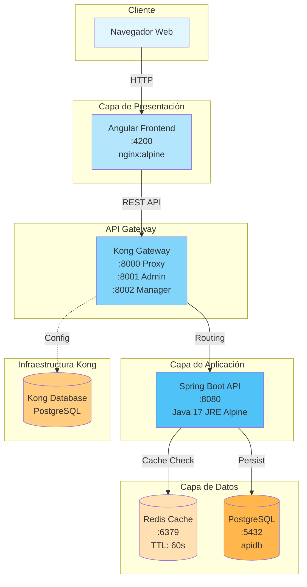

---

## Diagrama de Contenedores Docker

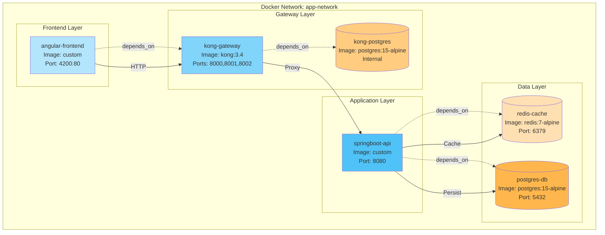

---

## Flujo de Datos - Operación GET con Cache

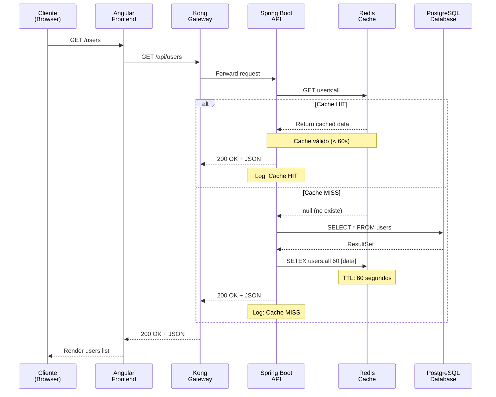

---

## Flujo de Datos - Operación POST (Invalidación de Cache)

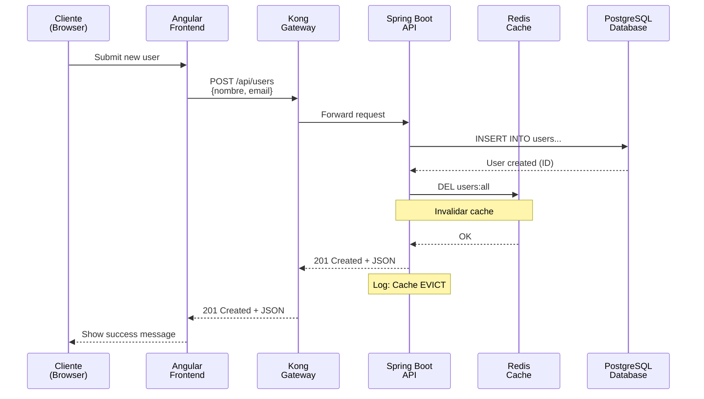

---

## Arquitectura Multi-Stage Build

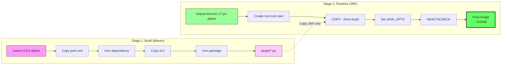

**Beneficios:**
- Stage 1 (~800MB): Descartado después del build
- Stage 2 (~200MB): Imagen final optimizada
- Reducción: **75% del tamaño**

---

## Capas de la Imagen Docker

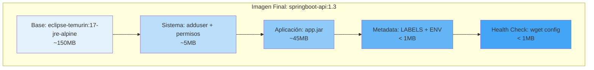

---

## Red Docker: app-network

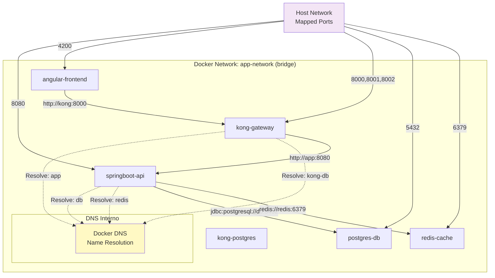

**Características:**
- DNS automático por nombre de container
- Comunicación interna sin exponer puertos
- Aislamiento de red completo

---

## Volúmenes Persistentes

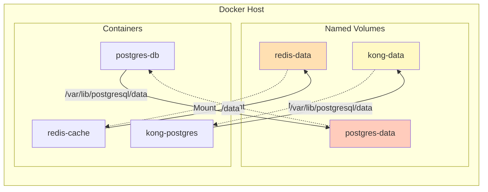

**Persistencia:**
- `postgres-data`: Base de datos principal (apidb)
- `redis-data`: Cache AOF (Append-Only File)
- `kong-data`: Configuración de Kong

---

## Seguridad: Capas de Protección

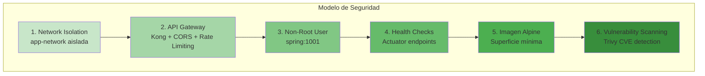

---

## Proceso de Inicialización

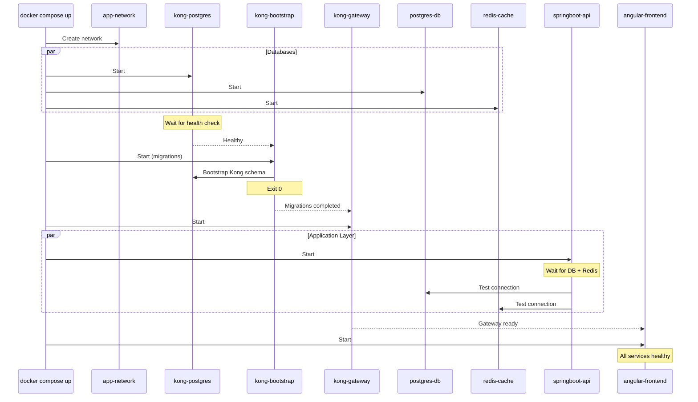

---

## Endpoints y Responsabilidades

| Servicio | Puerto | Responsabilidad | Health Check |
|----------|--------|-----------------|--------------|
| **angular-frontend** | 4200 | Interfaz de usuario, presentación | nginx health |
| **kong-gateway** | 8000 | Proxy público (entrada principal) | kong health |
| **kong-gateway** | 8001 | Admin API (configuración) | - |
| **kong-gateway** | 8002 | Kong Manager OSS (UI admin) | - |
| **springboot-api** | 8080 | Lógica de negocio, CRUD | /actuator/health |
| **postgres-db** | 5432 | Persistencia de datos | pg_isready |
| **redis-cache** | 6379 | Cache de consultas (TTL: 60s) | redis-cli ping |
| **kong-postgres** | 5432 | Configuración de Kong | pg_isready |

---

## Patrones de Diseño Implementados

### 1. API Gateway Pattern
- **Implementación**: Kong Gateway
- **Beneficio**: Punto único de entrada, CORS, rate limiting, logging centralizado

### 2. Cache-Aside Pattern
- **Implementación**: Spring Cache + Redis
- **Flujo**:
  1. Check cache
  2. If miss → query DB + store in cache
  3. If hit → return from cache

### 3. Multi-Stage Build Pattern
- **Implementación**: Dockerfile con 2 stages
- **Beneficio**: Imágenes pequeñas, seguras y rápidas

### 4. Health Check Pattern
- **Implementación**: Spring Actuator + Docker HEALTHCHECK
- **Beneficio**: Auto-healing, monitoring

### 5. Service Mesh (Light)
- **Implementación**: Docker Compose + custom network
- **Beneficio**: Service discovery, DNS interno

### 6. Backend-for-Frontend (BFF) Pattern
- **Implementación**: nginx como proxy dentro del contenedor frontend
- **Beneficio**: Comunicación DNS interna, configuración por entorno, arquitectura pedagogicamente correcta

---

## Patrón BFF (Backend-for-Frontend)

El frontend implementa el patrón **Backend-for-Frontend (BFF)** usando nginx como capa proxy para comunicarse con el backend mediante DNS interno.

### Motivación

Las aplicaciones Angular (SPAs) se ejecutan en el navegador del usuario, no dentro del contenedor. Esto presenta un desafío arquitectónico:

**Problema:**
- El código Angular se ejecuta en el navegador (cliente)
- El navegador NO puede resolver DNS internos de Docker/Kubernetes
- Hardcodear URLs (`http://localhost:8000`) solo funciona en desarrollo local
- `window.location.origin` funciona pero no demuestra la potencia del DNS interno

**Solución - BFF Pattern:**
- nginx dentro del contenedor frontend actúa como proxy
- El código Angular llama a rutas relativas (`/api/users`)
- nginx recibe la petición y la reenvía al backend usando DNS interno
- Configuración por entorno mediante variables de entorno

### Arquitectura BFF

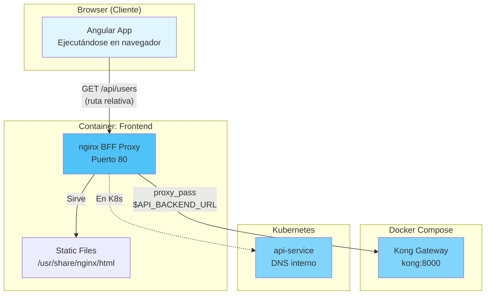

### Flujo de Comunicación

**Docker Compose:**
```
Browser → http://localhost:4200/api/users
  ↓
nginx BFF (dentro del contenedor frontend)
  ↓
proxy_pass → http://kong:8000/api/users (DNS interno)
  ↓
Kong Gateway → http://app:8080/api/users (DNS interno)
  ↓
Spring Boot API
```

**Kubernetes:**
```
Browser → http://<ingress-ip>/api/users
  ↓
Ingress Controller → frontend-service
  ↓
nginx BFF (dentro del pod frontend)
  ↓
proxy_pass → http://api-service.proyecto-integrador.svc.cluster.local:8080/api/users (DNS interno)
  ↓
Spring Boot API
```

### Configuración BFF

**nginx.conf.template:**
```nginx
server {
    listen 80;
    server_name localhost;
    root /usr/share/nginx/html;
    index index.html;

    # Frontend SPA (Angular)
    location / {
        try_files $uri $uri/ /index.html;
    }

    # BFF Proxy: /api → Backend
    location /api {
        proxy_pass ${API_BACKEND_URL};
        proxy_http_version 1.1;
        proxy_set_header Host $host;
        proxy_set_header X-Real-IP $remote_addr;
        proxy_set_header X-Forwarded-For $proxy_add_x_forwarded_for;
    }

    # BFF Proxy: /actuator → Backend health
    location /actuator {
        proxy_pass ${API_BACKEND_URL};
        proxy_http_version 1.1;
        proxy_set_header Host $host;
    }
}
```

**Dockerfile (envsubst para variables):**
```dockerfile
FROM nginx:1.25-alpine
RUN apk add --no-cache gettext

COPY nginx.conf.template /etc/nginx/templates/default.conf.template
ENV API_BACKEND_URL=http://localhost:8000

CMD ["/bin/sh", "-c", "envsubst '${API_BACKEND_URL}' < /etc/nginx/templates/default.conf.template > /etc/nginx/conf.d/default.conf && nginx -g 'daemon off;'"]
```

**docker-compose.yml:**
```yaml
frontend:
  environment:
    - API_BACKEND_URL=http://kong:8000
```

**Kubernetes ConfigMap:**
```yaml
apiVersion: v1
kind: ConfigMap
metadata:
  name: frontend-config
data:
  API_BACKEND_URL: "http://api-service.proyecto-integrador.svc.cluster.local:8080"
```

### Ventajas del Patrón BFF

| Aspecto | Sin BFF (hardcoded) | Con BFF |
|---------|---------------------|---------|
| **Comunicación** | `http://localhost:8000` | DNS interno (`kong:8000`, `api-service`) |
| **Portabilidad** | Solo funciona en local | Funciona en Docker Compose y K8s |
| **Configuración** | Hardcoded en código TS | Variable de entorno |
| **Seguridad** | Expone URLs internas | URLs internas ocultas |
| **Pedagógico** | No demuestra DNS | Demuestra DNS interno correctamente |
| **12-Factor App** | No cumple | Cumple (configuración externa) |

### Comparación con Otras Soluciones

**Opción A: window.location.origin (descartada)**
```typescript
// ❌ Funciona pero no es pedagógicamente correcto
private apiUrl = `${window.location.origin}/api/users`;
```
- Funciona en ambos entornos
- NO demuestra comunicación DNS interna
- NO enseña el patrón BFF

**Opción B: BFF Pattern (implementada)**
```typescript
// ✅ Pedagógicamente correcto
private apiUrl = '/api/users';  // Ruta relativa
```
- nginx BFF maneja el routing
- Comunicación DNS interna (enseñanza clave)
- Configuración por entorno
- Patrón profesional de microservicios

### Limitaciones de SPAs

Es importante entender por qué las SPAs no pueden usar DNS interno directamente:

**Backend → Backend (Java → PostgreSQL):**
```java
// ✅ Funciona: Se ejecuta DENTRO del contenedor
jdbc:postgresql://postgres-0.postgres-headless:5432/apidb
```

**Frontend → Backend (Angular → API):**
```typescript
// ❌ NO funciona: Angular se ejecuta en el NAVEGADOR del usuario
http://api-service.proyecto-integrador.svc.cluster.local:8080/api/users

// ✅ Funciona: Ruta relativa, nginx BFF hace el proxy
/api/users
```

**El navegador del usuario:**
- No está dentro del cluster de Docker/Kubernetes
- No tiene acceso al DNS interno
- Solo puede resolver DNS públicos

---

## Arquitectura Kubernetes (v2.0)

### Diagrama de Recursos Kubernetes

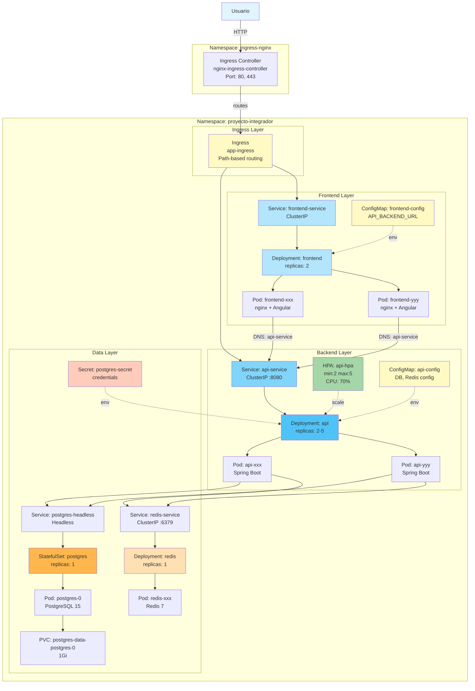

---

### Flujo de Comunicación en Kubernetes

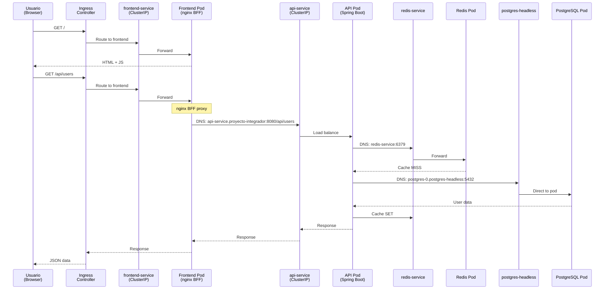

---

### Comparación: Docker Compose vs Kubernetes

| Aspecto | Docker Compose (v1.3) | Kubernetes (v2.0) |
|---------|----------------------|-------------------|
| **API Gateway** | Kong (8000, 8001, 8002) | NGINX Ingress (80, 443) |
| **Frontend** | 1 container | Deployment (2 pods) |
| **Backend** | 1 container | Deployment (2-5 pods con HPA) |
| **PostgreSQL** | 1 container | StatefulSet (1 pod) |
| **Redis** | 1 container | Deployment (1 pod) |
| **Networking** | Bridge network (DNS interno) | Services (ClusterIP + DNS) |
| **Config** | Environment vars en compose | ConfigMaps + Secrets |
| **Persistencia** | Named volumes | PersistentVolumeClaims |
| **Escalado** | Manual (`docker compose up --scale`) | Automático (HPA) |
| **Health Checks** | Docker HEALTHCHECK | Liveness/Readiness/Startup Probes |
| **BFF Pattern** | nginx proxy (API_BACKEND_URL=kong:8000) | nginx proxy (API_BACKEND_URL=api-service:8080) |
| **Acceso externo** | Port mapping (4200, 8000, 8080) | Ingress (path-based routing) |

---

### Patrón BFF en Kubernetes

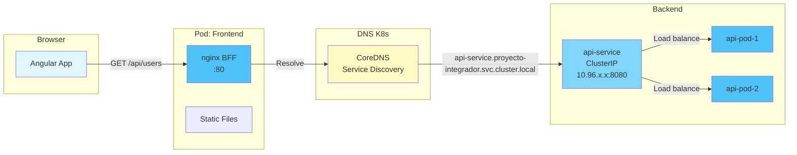

**ConfigMap frontend-config:**
```yaml
data:
  API_BACKEND_URL: "http://api-service.proyecto-integrador.svc.cluster.local:8080"
```

**Ventajas en K8s:**
- DNS interno automático
- Service discovery nativo
- Load balancing automático entre pods
- ConfigMap para configuración por entorno

---

### DNS en Kubernetes

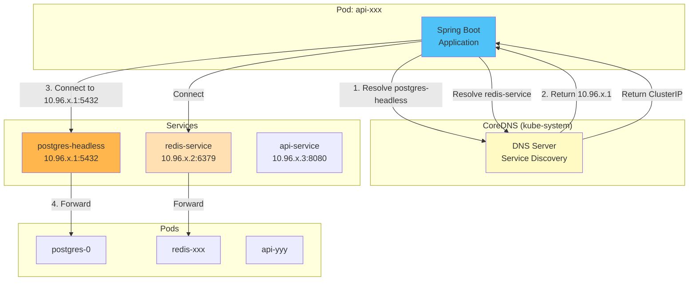

**DNS Names:**
- Short: `redis-service` (same namespace)
- FQDN: `redis-service.proyecto-integrador.svc.cluster.local`
- Headless: `postgres-0.postgres-headless.proyecto-integrador.svc.cluster.local`

---

### Health Probes en Acción

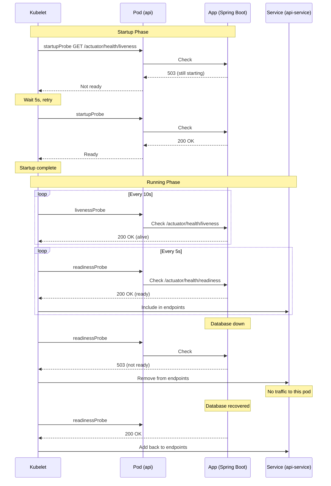

---

### HPA (Horizontal Pod Autoscaler) en Acción

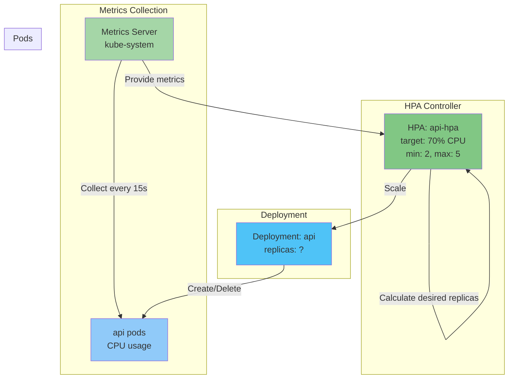

**Cálculo de réplicas:**
```
desiredReplicas = ceil(currentReplicas * (currentMetric / targetMetric))

Ejemplo:
- currentReplicas: 2
- currentCPU: 140% (promedio)
- targetCPU: 70%
- desiredReplicas = ceil(2 * (140 / 70)) = ceil(4) = 4 pods
```

---

### Arquitectura de Networking

```mermaid
graph TB
    subgraph "External World"
        USER[Usuario<br/>Browser]
    end

    subgraph "Kubernetes Cluster"
        subgraph "Ingress Namespace"
            INGCTRL[Ingress Controller<br/>NodePort: 32228/32387]
        end

        subgraph "proyecto-integrador Namespace"
            ING[Ingress Resource<br/>app-ingress]

            subgraph "ClusterIP Services"
                FESVC[frontend-service<br/>10.96.x.1:80]
                APISVC[api-service<br/>10.96.x.2:8080]
                RDSVC[redis-service<br/>10.96.x.3:6379]
            end

            subgraph "Headless Service"
                PGSVC[postgres-headless<br/>None (no ClusterIP)]
            end

            subgraph "Pods"
                FE[frontend pods]
                API[api pods]
                PG[postgres-0<br/>Pod IP: 10.244.x.x]
                RD[redis pod]
            end
        end
    end

    USER -->|HTTP :80| INGCTRL
    INGCTRL -->|Routing rules| ING
    ING -.->|/ → frontend| FESVC
    ING -.->|/api → backend| APISVC

    FESVC -->|Round-robin| FE
    APISVC -->|Round-robin| API
    RDSVC -->|Forward| RD
    PGSVC -.->|Direct DNS to Pod IP| PG

    FE -->|BFF proxy| APISVC
    API --> RDSVC
    API --> PGSVC

    style USER fill:#e1f5ff
    style INGCTRL fill:#fff9c4
    style ING fill:#fff3cd
    style FESVC fill:#b3e5fc
    style APISVC fill:#81d4fa
    style PGSVC fill:#ffb74d
    style PG fill:#ff9800
```

---

## Evolución de Arquitectura

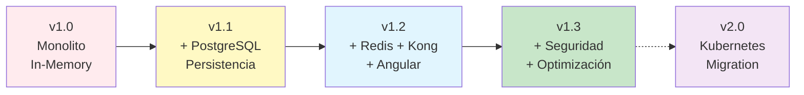

---

## Decisiones de Arquitectura

### ¿Por qué Kong y no Nginx?
- Admin API REST (fácil configuración)
- Plugins (CORS, rate limiting, auth)
- Kong Manager OSS (UI visual)
- Preparación para Kubernetes (Kong Ingress)

### ¿Por qué Redis y no Memcached?
- Persistencia (AOF)
- Estructuras de datos avanzadas
- Pub/Sub (futuro)
- Integración nativa con Spring

### ¿Por qué PostgreSQL y no MySQL?
- JSON nativo (extensibilidad futura)
- ACID completo
- Estándar en ecosistema Kong
- Open source sin restricciones

### ¿Por qué Alpine y no Ubuntu?
- Tamaño: 5MB vs 70MB base
- Superficie de ataque mínima
- Menos vulnerabilidades CVE
- Startup más rápido

---

## Métricas de Performance

| Métrica | Valor | Objetivo |
|---------|-------|----------|
| Startup time (cold) | ~15s | < 30s |
| Startup time (warm) | ~5s | < 10s |
| GET /api/users (cache hit) | ~10ms | < 50ms |
| GET /api/users (cache miss) | ~200ms | < 500ms |
| POST /api/users | ~150ms | < 300ms |
| Imagen Docker | ~200MB | < 300MB |
| Memoria (app) | ~400MB | < 512MB |

---

## Referencias

- [Spring Boot Documentation](https://docs.spring.io/spring-boot/)
- [Kong Gateway Documentation](https://docs.konghq.com/gateway/)
- [Redis Cache Docs](https://redis.io/docs/latest/)
- [Docker Multi-Stage Builds](https://docs.docker.com/build/building/multi-stage/)
- [PostgreSQL Best Practices](https://www.postgresql.org/docs/current/index.html)
- [Mermaid](https://mermaid.js.org/)

---

**Autor:** Alejandro Fiengo (alefiengo)
**Versión:** 2.0.0
**Última actualización:** Octubre 2025
